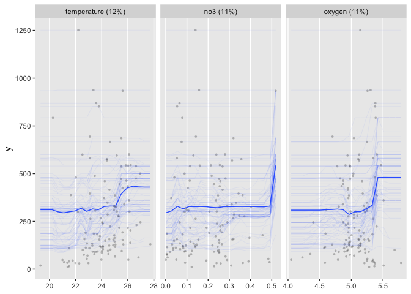

# coclimer

R package to standardise statistical analyses of time series in the
CoClime project.

## Installation

The package is not on CRAN. Install it with

``` r
# if needed
install.packages("devtools")
# then
devtools::install_github("jiho/coclimer")
```

## Usage

Load the package

``` r
library("coclimer")
```

A test dataset is included in the package, containing the concentration
of *Ostreopsis ovata* in two forms and environemental variables. Read
more about it with

``` r
?ost
```

Make it available and inspect it with

``` r
data(ost)
head(ost)
```

    ## # A tibble: 6 x 13
    ##   date       benthic planktonic  chla   no2   no3 oxygen    po4   poc   pon
    ##   <date>       <dbl>      <dbl> <dbl> <dbl> <dbl>  <dbl>  <dbl> <dbl> <dbl>
    ## 1 2007-01-01       0          0 0.416 0.077 0.438   5.64 0.08    78.1  7.9 
    ## 2 2007-01-08       0          0 0.416 0.077 0.438   5.64 0.08    78.1  7.9 
    ## 3 2007-01-15       0          0 0.367 0.129 0.378   5.62 0.0873  60.0  5.84
    ## 4 2007-01-22       0          0 0.309 0.189 0.309   5.65 0.0958  38.8  3.44
    ## 5 2007-01-29       0          0 0.351 0.209 0.462   5.73 0.243   41.2  6.19
    ## 6 2007-02-05       0          0 0.398 0.336 0.654   5.80 0.145   60.9  3.87
    ## # … with 3 more variables: salinity <dbl>, sioh4 <dbl>, temperature <dbl>

Your data should be made to look the same: a `date` column, columns for
species concentrations/abundances, columns for environmental variables.

Plot the data

``` r
# full time series
plot_multi(ost, benthic:planktonic)
```

<!-- -->

``` r
plot_multi(ost, benthic:planktonic, trans="sqrt")
```

<!-- -->

``` r
# seasonal view
plot_seasonal(ost, benthic:planktonic, trans="sqrt")
```

<!-- -->

Compute standardised yearly statistics

``` r
# for benthic concentration
yearly_stats(ost$date, ost$benthic, bloom_threshold=200000)
```

    ## # A tibble: 11 x 7
    ##     year max_conc int_conc day_max_con day_start_bloom day_end_bloom
    ##    <dbl>    <dbl>    <dbl>       <dbl>           <dbl>         <dbl>
    ##  1  2007 1565514.   1.21e7         183             177           189
    ##  2  2008  359865.   7.61e6         197             191           204
    ##  3  2009  481637.   5.23e6         180             176           185
    ##  4  2010  443729.   6.99e6         193             190           205
    ##  5  2011  755554.   2.06e7         207             189           222
    ##  6  2012  293989.   7.58e6         191             188           235
    ##  7  2013  871727.   1.40e7         203             197           235
    ##  8  2014  878630.   1.06e7         196             185           200
    ##  9  2015  212300.   4.04e6         180             180           180
    ## 10  2016  288864.   7.03e6         214             212           222
    ## 11  2017  469755.   1.73e7         198             175           223
    ## # … with 1 more variable: nb_days_bloom <dbl>

Inspect correlations of abundance with environmental variables

``` r
suppressMessages(library("tidyverse"))
d <- filter(ost, benthic>0)
correlate(sqrt(d$benthic), select(d, chla:temperature), n=3)
```

<!-- -->

Read more in the help of the functions.
